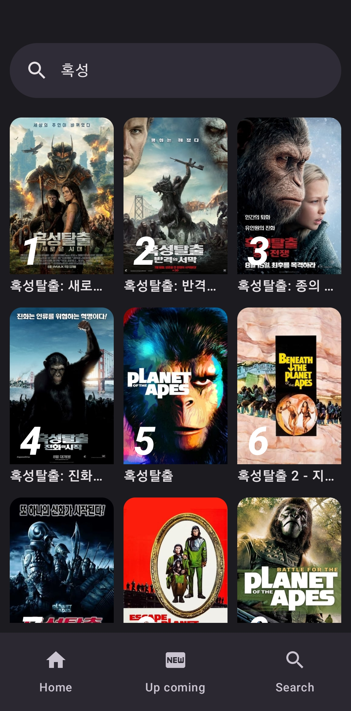

[]()
[]()
# Movies
Movies app contains features like Trailer playback, Home feed, Movies coming soon, Search / View for movie, tv shows. It uses APIs from [TMDB - The Movie Database](https://www.themoviedb.org/documentation/api).

## Preview
<p align="center">
  
  
  
  
  
  
</p>

## Local setup
* Generate an api_key from [https://developers.themoviedb.org/3](https://developers.themoviedb.org/3)\
* Update the following line in local.properties
```
api_key=YOUR_TMDB_API_KEY
api_base_url=TMDB_API_URL
```
